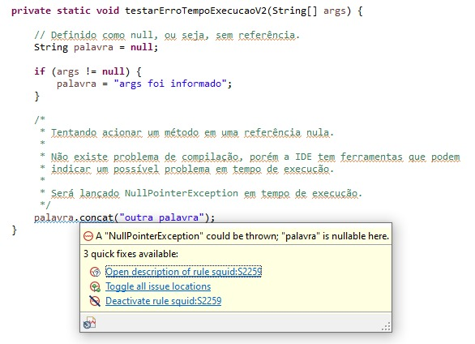

# testes-java
Simulando alguns testes básicos da linguagem para fins de didática.

## Exemplo de erro de compilação

O código nunca irá rodar pois ele sequer compilou.

## Exemplo de erro em tempo de execução

Sabemos que sempre dará erro em tempo de execução por conta da programação mal feita.

## Exemplo de erro em tempo de execução V2

Neste caso ele pode dar erro caso não seja informado o "args".

